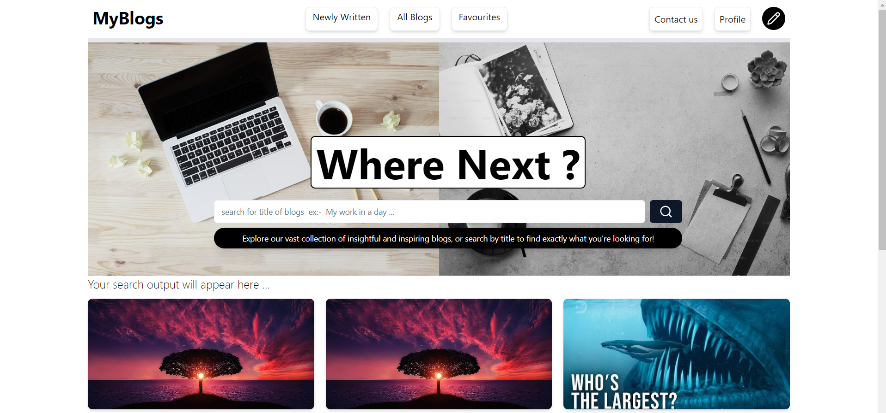
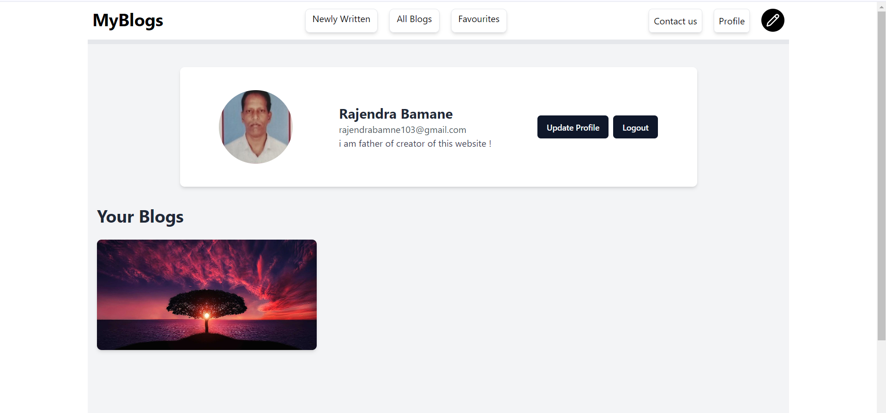
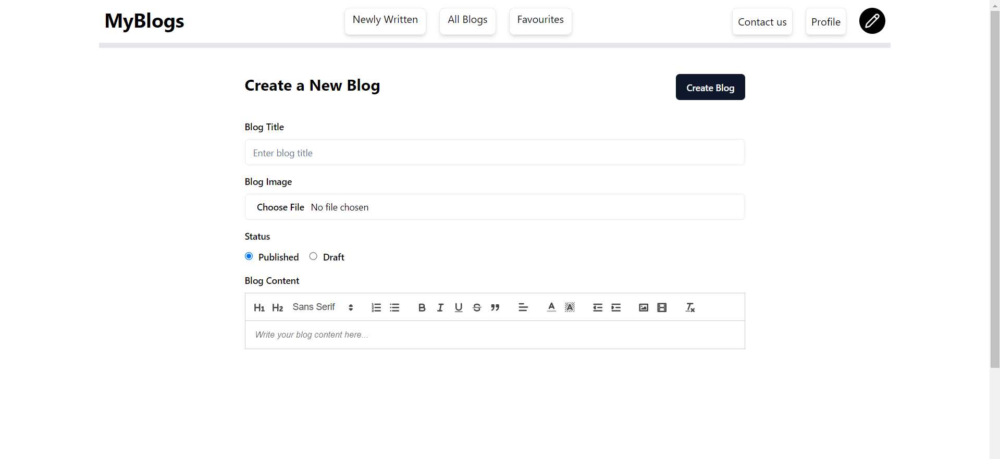
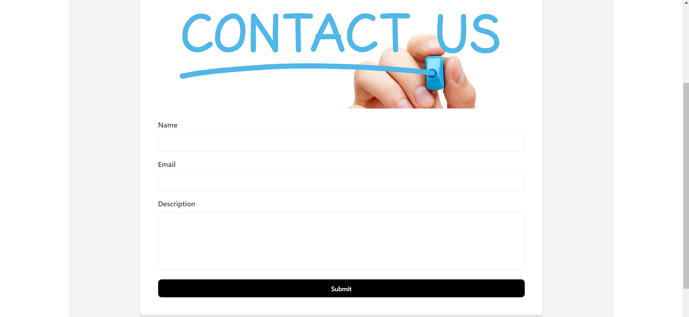

<h1>Blog Website using React and Appwrite</h1>

A fully functional blog website built with <strong>React</strong> and powered by <strong>Appwrite</strong> for backend services. The platform allows users to create, read, and manage blog posts with additional features like search, favorites, and contact forms.

<h2>Features</h2>
<ul>
  <li><strong>Create & Read Blogs:</strong> Users can create and publish their own blog posts, as well as browse through existing blogs.</li>
  <li><strong>Search Functionality:</strong> Easily find blogs using keywords or categories through a powerful search bar.</li>
  <li><strong>Favorites:</strong> Save your favorite blogs for easy access in the future.</li>
  <li><strong>Contact Us:</strong> A contact page to allow users to reach out with inquiries or feedback.</li>
</ul>

<h2>Pages Overview</h2>

<h3>1. Home Page</h3>

The landing page where users can view all available blogs, search for content, and explore featured posts.

<h3>2. Profile Page</h3>

The profile page allows users to view their own blog posts, edit existing posts, and manage their favorites.

<h3>3. Create Post Page</h3>

Users can write and publish new blog posts using a rich-text editor with additional media upload features.

<h3>4. Contact Page</h3>

The contact page allows users to send inquiries, feedback, or support requests directly to the website administrators.

<h2>Tech Stack</h2>
<ul>
  <li><strong>Frontend:</strong> React.js for creating the interactive user interface.</li>
  <li><strong>Backend:</strong> Appwrite for handling authentication, databases, and blog post management.</li>
  <li><strong>Styling:</strong> Tailwind CSS for responsive and modern design.</li>
</ul>

<h2>Installation & Setup</h2>
<ol>
  <li>Clone the repository:
    <pre><code>git clone https://github.com/AniketBamane/blog-website.git
cd blog-website</code></pre>
  </li>
  <li>Install dependencies:
    <pre><code>npm install</code></pre>
  </li>

<h2>Contributing</h2>

Contributions are welcome! Please fork the repository and create a pull request with a clear description of your changes.

<h2>License</h2>

This project is licensed under the MIT License. See the <a href="LICENSE">LICENSE</a> file for more details.

